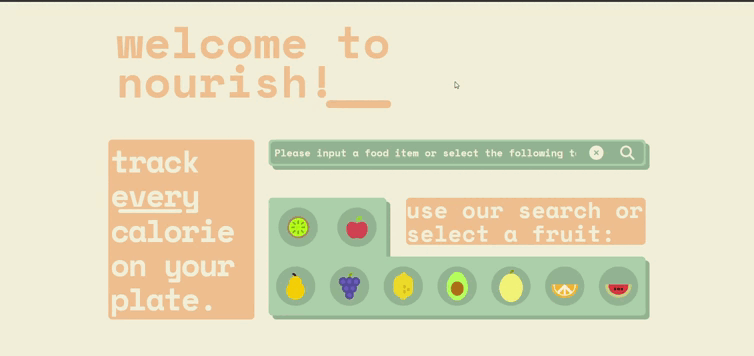

# About nourish
Nourish is an app to keep track of your calorie intake


## To start
```shell
python3 -m venv venv
. venv/bin/activate
pip install -r requirements.txt
# To create .env
echo "API_KEY="Your API KEY without quotes"" > .env
# To run app
flask --app app/main run
```
### Where to get API_KEY

1. Go to https://fdc.nal.usda.gov/api-key-signup.html 
2. Fill the form and get `API KEY`
3. Use command from ["To start"](#to-start) to create .env


